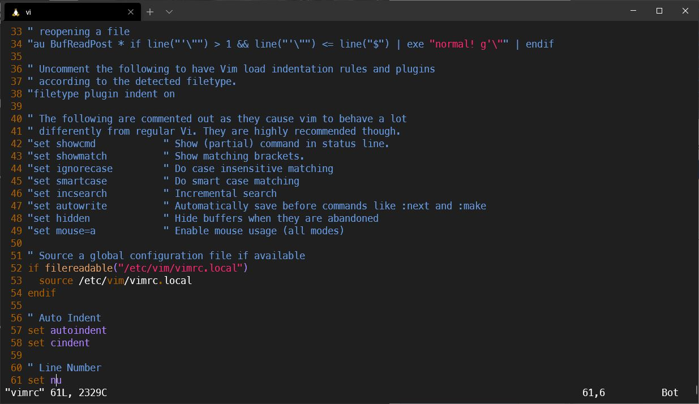
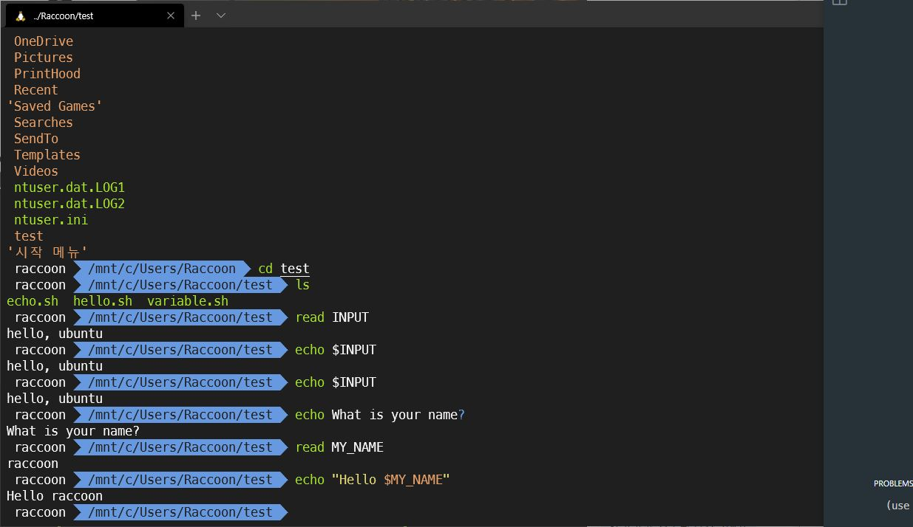
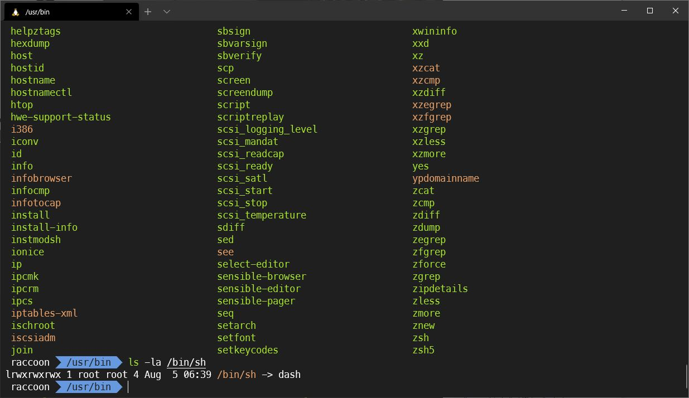

# Mission: Shell script 정복기

- Shell Script를 한 번 본 후, 실습을 해보려고하니 너무 불편하고 안예쁨
- 조금만! 예쁘게 만들어보기로 함
- vimrc 수정

  

- Shell Script 실습 중

  

- script를 보다보니 [#!/bin/sh](https://storycompiler.tistory.com/101) 가 계속 나오는데 뭔지 궁금해져서 좀 찾아봤다.

  ```
  ls -la /bin/sh
  ```

  

  ```
  lrwxrwxrwx 1 root root 4 Aug  5 06:39 /bin/sh -> dash
  ```

  - dash에 링크가 걸려있다
  - dash와 bash에 대해 짧게 알아본 재미있는 시간이었다.
    - dash: 상대적으로 가벼움(Ubuntu 6.06부터)
    - bash: 기능이 풍부함(로그인 쉘)
    - 세대교체에 따른 세대차이가 좀 있다고 이해하고 넘어감
